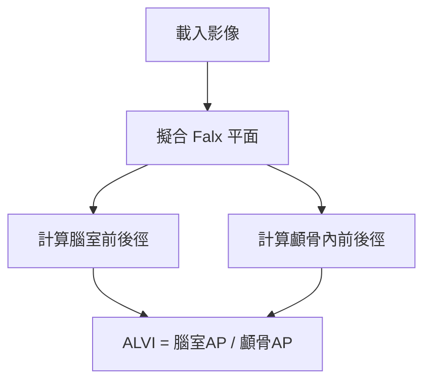
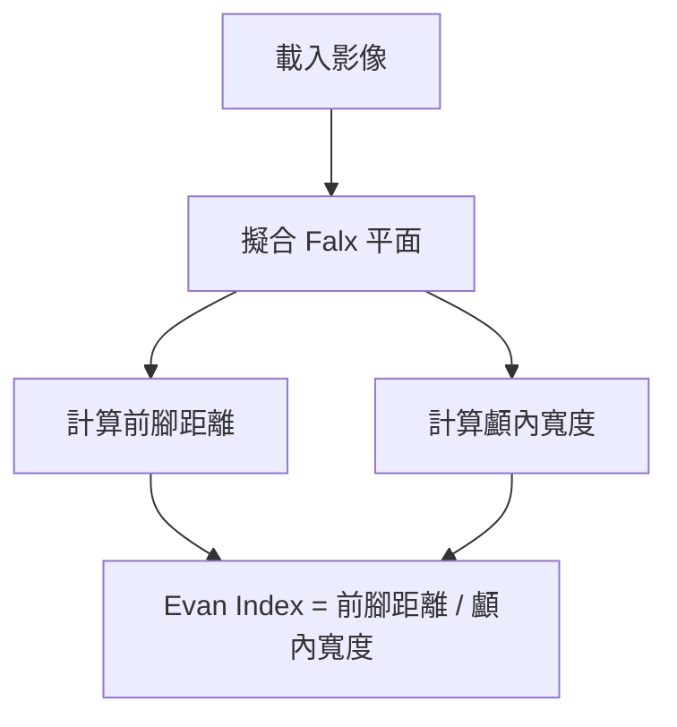

# NPH 診斷指標算法說明

本文檔詳細說明用於正常壓力水腦症 (Normal Pressure Hydrocephalus, NPH) 診斷的兩個主要 3D 影像分析指標：**ALVI** 和 **Evan Index**。

---

## 目錄

1. [ALVI (Anteroposterior Lateral Ventricle Index)](#alvi-anteroposterior-lateral-ventricle-index)
2. [Evan Index (3D)](#evan-index-3d)
3. [共用計算模組](#共用計算模組)

---

## ALVI (Anteroposterior Lateral Ventricle Index)

### 定義

ALVI = 側腦室前後徑 / 顱骨內前後徑

- **正常值**: < 0.5
- **NPH 診斷閾值**: > 0.5

### 💡 白話文總結

> **「把腦室從側面壓到大腦 Falx 平面上，然後量這個扁平形狀的最長距離。」**

---

### 算法流程



---

### 1. Falx 平面擬合

**目的**: 建立大腦中線參考平面，用於分離左右腦室及確保測量在正中矢狀面上。

**方法**:
1. 使用 **Marching Cubes** 從 Falx mask 提取平滑表面頂點
2. 計算頂點的中心點 (centroid)
3. 對中心化後的點雲進行 **SVD 分解**
4. 取最小奇異值對應的向量作為平面法向量
5. 確保法向量指向 X 正方向 (左右方向)

**平面方程式**: `Ax + By + Cz + D = 0`

```python
# SVD 分解找平面法向量
_, _, Vt = np.linalg.svd(centered_points, full_matrices=False)
normal = Vt[2]  # 最小奇異值對應的向量
```

---

### 2. 腦室前後徑計算

**方法**: Falx 平面投影 + Convex Hull

#### 🎯 為什麼投影到 Falx 平面？

| 好處 | 說明 |
|------|------|
| **方向一致** | 所有病人的測量方向都平行於大腦中線，結果更具可比性 |
| **符合臨床習慣** | 等同於 3D 版本的矢狀切面測量 |
| **消除頭位影響** | Falx 是解剖結構，可自動校正頭部傾斜 |
| **避免斜向假距離** | 保證測量的是真正的前後方向 |

#### 步驟:

1. **取得腦室點雲** 
   - 讀取左右腦室 mask
   - 保留最大連通區域 (去除噪聲)
   - 轉換為物理座標 (mm)

2. **過濾跨中線點**
   - 使用 Falx 平面計算點的有向距離
   - 左腦室保留負距離點，右腦室保留正距離點

3. **Z 軸體部篩選** (30%-70%)
   - 計算 Z 軸的第 30 和第 70 百分位數
   - 只保留此範圍內的點 (腦室體部)

4. **投影到 Falx 平面**
   - 將 3D 點雲投影到平面上 (從側面壓扁)
   - 公式: `P' = P - distance × unit_normal`

5. **排除異常點** (0.5%-99.5%)
   - 使用 PCA 找出投影點的主軸方向
   - 沿主軸計算 1D 投影值
   - 排除最極端的 0.5% 點

6. **Convex Hull 找最長徑**
   - 對過濾後的點計算凸包
   - 在凸包頂點中找出最遠點對
   - 此距離即為前後徑

7. **左右取最大值**
   - 分別計算左右腦室的前後徑
   - 取較大者作為最終腦室前後徑

```python
# 投影到 Falx 平面
projected_points = project_points_to_plane(body_points, falx_plane)

# Convex Hull 找最長徑
diameter, p1, p2 = find_max_diameter_convex_hull(filtered_points)
```

---

### 3. 顱骨內前後徑計算

**方法**: 在 Falx 平面上測量 Y 軸最大距離

#### 💡 白話文

> **「在 Falx 平面附近（±3mm），量從額頭到後腦勺的距離。」**

#### 步驟:

1. **取得腦部非零點**
   - 讀取原始腦部影像
   - 轉換為物理座標

2. **篩選 Z 軸範圍**
   - 使用與腦室相同的 Z 軸範圍 (30%-70%)

3. **篩選接近 Falx 平面的點**
   - 計算每個點到 Falx 平面的距離
   - 只保留距離 ≤ 3mm (或 5mm 作為 fallback) 的點

4. **計算 Y 軸最大距離**
   - 在篩選後的點中找 Y 軸最小值 (後端點)
   - 找 Y 軸最大值 (前端點)
   - 距離 = Y_max - Y_min

```python
# 篩選接近 Falx 平面的點
distances = np.abs(A * points[:, 0] + B * points[:, 1] + C * points[:, 2] + D) / norm
near_falx_mask = distances <= distance_threshold  # 3mm or 5mm
```

---

### 4. ALVI 計算公式

```python
alvi = ventricle_ap / skull_ap
alvi_percent = alvi * 100
```

---

## Evan Index (3D)

### 定義

Evan Index = 腦室前腳橫向距離 / 顱內最大橫向寬度

- **正常值**: < 0.3
- **NPH 診斷閾值**: ≥ 0.3

### 算法流程



---

### 1. 前腳距離計算 (Falx-based 方法)

**目的**: 測量左右腦室前腳 (anterior horn) 之間的最大橫向距離

#### 步驟:

1. **合併左右腦室點雲**
   - 讀取左右腦室 mask
   - 使用 Falx 平面過濾跨中線的點 (去噪)
   - 轉換為物理座標並合併

2. **Y 軸前腳區域篩選** (前 30%)
   - 計算左右腦室質心
   - 計算平均質心的 Y 座標
   - 篩選條件: `Y >= centroid_Y + 0.7 × (Y_max - centroid_Y)`
   - 只保留最前方 30% 區域的點

3. **Z 軸雜訊過濾** (> 15%)
   - 計算 Z 軸的第 15 百分位數
   - 排除最低 15% 的異常點 (通常為偽影)

4. **使用 Falx 平面分左右側**
   - 計算點到 Falx 平面的有向距離
   - 正距離 = 右側，負距離 = 左側

5. **各側找最大 X 距離**
   - 計算每個點到 Falx 中心的 X 軸距離
   - 左側取距離最大的點
   - 右側取距離最大的點

6. **總距離計算**
   - `前腳距離 = 左側最大距離 + 右側最大距離`

```python
# Y 軸前腳篩選
y_threshold = avg_centroid_y + 0.7 * (all_y_max - avg_centroid_y)
anterior_points = all_points[all_points[:, 1] >= y_threshold]

# Z 軸過濾
z_p15 = np.percentile(anterior_points[:, 2], 15)
filtered_points = anterior_points[anterior_points[:, 2] >= z_p15]

# 計算前腳距離
total_distance = left_max_distance + right_max_distance
```

---

### 2. 顱內寬度計算 (Falx-based 方法)

**目的**: 測量顱骨內的最大橫向寬度

#### 步驟:

1. **取得腦部非零點**
   - 讀取原始腦部影像
   - 轉換為物理座標

2. **使用 Falx 平面分左右側**
   - 計算每個點到 Falx 平面的有向距離
   - 正距離 = 右側，負距離 = 左側

3. **各側找最大距離**
   - 左側找到 Falx 平面最遠的點
   - 右側找到 Falx 平面最遠的點

4. **總寬度計算**
   - `顱內寬度 = 左側最大距離 + 右側最大距離`

```python
# 顱內寬度計算
left_max_distance = np.max(np.abs(signed_distances[left_mask]))
right_max_distance = np.max(signed_distances[right_mask])
max_width = left_max_distance + right_max_distance
```

---

### 3. Evan Index 計算公式

```python
evan_index = anterior_distance / cranial_width
evan_index_percent = evan_index * 100
```

---

## 共用計算模組

### Falx 有向距離計算

```python
def calculate_signed_distances(points, falx_plane):
    A, B, C, D = falx_plane['A'], falx_plane['B'], falx_plane['C'], falx_plane['D']
    norm = np.sqrt(A**2 + B**2 + C**2)
    distances = (A * points[:, 0] + B * points[:, 1] + C * points[:, 2] + D) / norm
    return distances
```

- **正值**: 在法向量指向的一側 (右側)
- **負值**: 在另一側 (左側)

---

### 點雲投影到平面

```python
def project_points_to_plane(points, plane_params):
    # 計算點到平面的距離 (帶正負)
    distances = (A * points[:, 0] + B * points[:, 1] + C * points[:, 2] + D) / sqrt(norm_sq)
    
    # 投影點 P' = P - distance × unit_normal
    unit_normal = normal / np.sqrt(norm_sq)
    projected_points = points - np.outer(distances, unit_normal)
    return projected_points
```

---

### Convex Hull 最長徑

```python
def find_max_diameter_convex_hull(points):
    # 1. 使用 SVD 投影到 2D
    _, _, Vt = np.linalg.svd(centered, full_matrices=False)
    points_2d = centered @ Vt[:2].T
    
    # 2. 計算凸包
    hull = ConvexHull(points_2d)
    
    # 3. 在凸包頂點中找最遠點對
    dists = pdist(hull_points_2d)
    dist_matrix = squareform(dists)
    i, j = np.unravel_index(np.argmax(dist_matrix), dist_matrix.shape)
    
    return dist_matrix[i, j], hull_points_3d[i], hull_points_3d[j]
```

---

## 座標系統說明

本系統使用 **RAS+** (Right-Anterior-Superior) 座標系統：

| 軸 | 正方向 | 意義 |
|---|---|---|
| **X** | 右 (Right) | 左右方向 |
| **Y** | 前 (Anterior) | 前後方向 |
| **Z** | 上 (Superior) | 上下方向 |

所有影像在載入時會自動拉正到 RAS+ 方向，確保計算一致性。

---

## 診斷閾值總結

| 指標 | 正常值 | NPH 提示 |
|---|---|---|
| **ALVI** | < 0.5 (50%) | ≥ 0.5 (50%) |
| **Evan Index** | < 0.3 (30%) | ≥ 0.3 (30%) |

---

## 參考文獻

- Evan's Index: Evans, W. A. (1942). An encephalographic ratio for estimating ventricular enlargement and cerebral atrophy.
- NPH Guidelines: Relkin, N., et al. (2005). Diagnosing idiopathic normal-pressure hydrocephalus.
