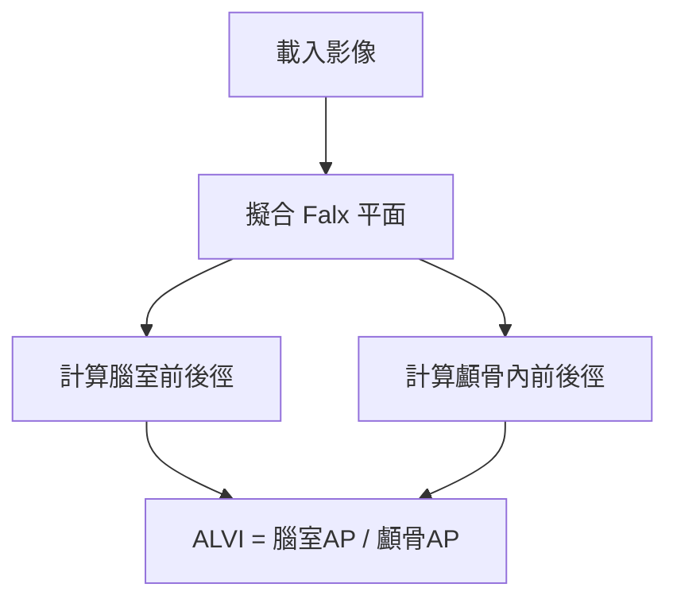
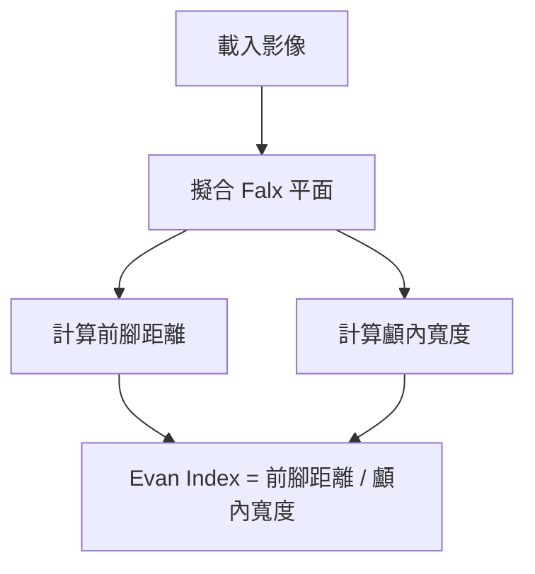
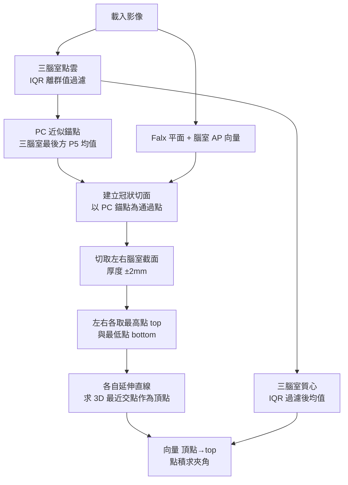
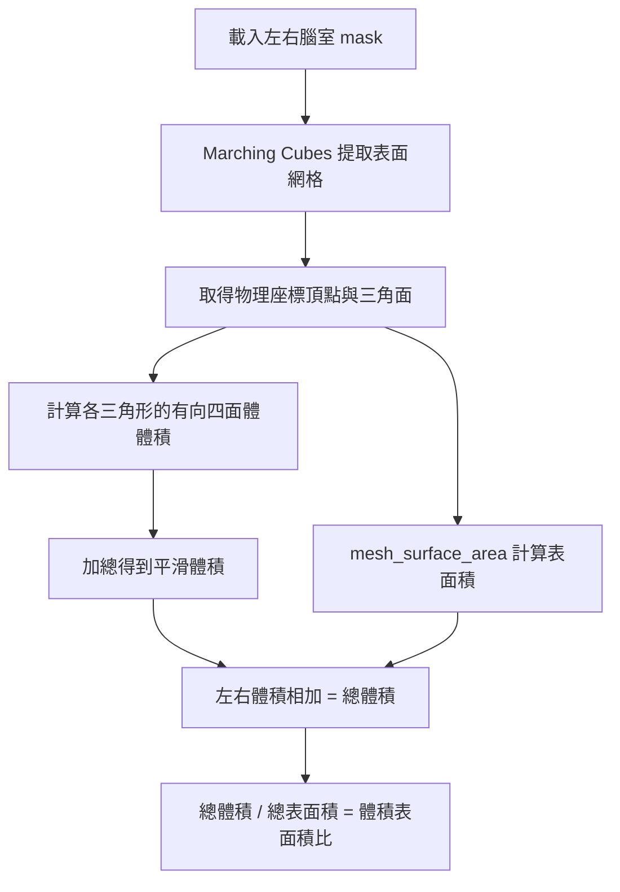

# NPH 診斷指標算法說明

本文檔詳細說明用於正常壓力水腦症 (Normal Pressure Hydrocephalus, NPH) 診斷的 3D 影像分析指標：**ALVI**、**Evan Index**、**Callosal Angle** 與 **腦室體積**。

---

## 目錄

1. [ALVI (Anteroposterior Lateral Ventricle Index)](#alvi-anteroposterior-lateral-ventricle-index)
2. [Evan Index (3D)](#evan-index-3d)
3. [Callosal Angle (胼胝體角)](#callosal-angle-胼胝體角)
4. [腦室體積與表面積](#腦室體積與表面積-ventricle-volume--surface-area)
5. [共用計算模組](#共用計算模組)

---

## ALVI (Anteroposterior Lateral Ventricle Index)

### 定義

ALVI = 側腦室前後徑 / 顱骨內前後徑

- **正常值**: < 0.5
- **NPH 診斷閾值**: > 0.5

### 💡 白話文總結

> **「把腦室從側面壓到大腦 Falx 平面上，然後量這個扁平形狀的最長距離。」**

---

### 算法流程



---

### 1. Falx 平面擬合

**目的**: 建立大腦中線參考平面，用於分離左右腦室及確保測量在正中矢狀面上。

**方法**:
1. 使用 **Marching Cubes** 從 Falx mask 提取平滑表面頂點
2. 計算頂點的中心點 (centroid)
3. 對中心化後的點雲進行 **SVD 分解**
4. 取最小奇異值對應的向量作為平面法向量
5. 確保法向量指向 X 正方向 (左右方向)

**平面方程式**: `Ax + By + Cz + D = 0`

```python
# SVD 分解找平面法向量
_, _, Vt = np.linalg.svd(centered_points, full_matrices=False)
normal = Vt[2]  # 最小奇異值對應的向量
```

---

### 2. 腦室前後徑計算

**方法**: Falx 平面投影 + Convex Hull

#### 🎯 為什麼投影到 Falx 平面？

| 好處 | 說明 |
|------|------|
| **方向一致** | 所有病人的測量方向都平行於大腦中線，結果更具可比性 |
| **符合臨床習慣** | 等同於 3D 版本的矢狀切面測量 |
| **消除頭位影響** | Falx 是解剖結構，可自動校正頭部傾斜 |
| **避免斜向假距離** | 保證測量的是真正的前後方向 |

#### 步驟:

1. **取得腦室點雲** 
   - 讀取左右腦室 mask
   - 保留最大連通區域 (去除噪聲)
   - 轉換為物理座標 (mm)

2. **過濾跨中線點**
   - 使用 Falx 平面計算點的有向距離
   - 左腦室保留負距離點，右腦室保留正距離點

3. **Z 軸體部篩選** (30%-70%)
   - 計算 Z 軸的第 30 和第 70 百分位數
   - 只保留此範圍內的點 (腦室體部)

4. **投影到 Falx 平面**
   - 將 3D 點雲投影到平面上 (從側面壓扁)
   - 公式: `P' = P - distance × unit_normal`

5. **排除異常點** (0.5%-99.5%)
   - 使用 PCA 找出投影點的主軸方向
   - 沿主軸計算 1D 投影值
   - 排除最極端的 0.5% 點

6. **Convex Hull 找最長徑**
   - 對過濾後的點計算凸包
   - 在凸包頂點中找出最遠點對
   - 此距離即為前後徑

7. **左右取最大值**
   - 分別計算左右腦室的前後徑
   - 取較大者作為最終腦室前後徑

```python
# 投影到 Falx 平面
projected_points = project_points_to_plane(body_points, falx_plane)

# Convex Hull 找最長徑
diameter, p1, p2 = find_max_diameter_convex_hull(filtered_points)
```

---

### 3. 顱骨內前後徑計算

**方法**: 在 Falx 平面上測量 Y 軸最大距離

#### 💡 白話文

> **「在 Falx 平面附近（±3mm），量從額頭到後腦勺的距離。」**

#### 步驟:

1. **取得腦部非零點**
   - 讀取原始腦部影像
   - 轉換為物理座標

2. **篩選 Z 軸範圍**
   - 使用與腦室相同的 Z 軸範圍 (30%-70%)

3. **篩選接近 Falx 平面的點**
   - 計算每個點到 Falx 平面的距離
   - 只保留距離 ≤ 3mm (或 5mm 作為 fallback) 的點

4. **計算 Y 軸最大距離**
   - 在篩選後的點中找 Y 軸最小值 (後端點)
   - 找 Y 軸最大值 (前端點)
   - 距離 = Y_max - Y_min

```python
# 篩選接近 Falx 平面的點
distances = np.abs(A * points[:, 0] + B * points[:, 1] + C * points[:, 2] + D) / norm
near_falx_mask = distances <= distance_threshold  # 3mm or 5mm
```

---

### 4. ALVI 計算公式

```python
alvi = ventricle_ap / skull_ap
alvi_percent = alvi * 100
```

---

## Evan Index (3D)

### 定義

Evan Index = 腦室前腳橫向距離 / 顱內最大橫向寬度

- **正常值**: < 0.3
- **NPH 診斷閾值**: ≥ 0.3

### 算法流程



---

### 1. 前腳距離計算 (Falx-based 方法)

**目的**: 測量左右腦室前腳 (anterior horn) 之間的最大橫向距離

#### 步驟:

1. **合併左右腦室點雲**
   - 讀取左右腦室 mask
   - 使用 Falx 平面過濾跨中線的點 (去噪)
   - 轉換為物理座標並合併

2. **Y 軸前腳區域篩選** (前 30%)
   - 計算左右腦室質心
   - 計算平均質心的 Y 座標
   - 篩選條件: `Y >= centroid_Y + 0.7 × (Y_max - centroid_Y)`
   - 只保留最前方 30% 區域的點

3. **Z 軸雜訊過濾** (> 15%)
   - 計算 Z 軸的第 15 百分位數
   - 排除最低 15% 的異常點 (通常為偽影)

4. **使用 Falx 平面分左右側**
   - 計算點到 Falx 平面的有向距離
   - 正距離 = 右側，負距離 = 左側

5. **各側找最大 X 距離**
   - 計算每個點到 Falx 中心的 X 軸距離
   - 左側取距離最大的點
   - 右側取距離最大的點

6. **總距離計算**
   - `前腳距離 = 左側最大距離 + 右側最大距離`

```python
# Y 軸前腳篩選
y_threshold = avg_centroid_y + 0.7 * (all_y_max - avg_centroid_y)
anterior_points = all_points[all_points[:, 1] >= y_threshold]

# Z 軸過濾
z_p15 = np.percentile(anterior_points[:, 2], 15)
filtered_points = anterior_points[anterior_points[:, 2] >= z_p15]

# 計算前腳距離
total_distance = left_max_distance + right_max_distance
```

---

### 2. 顱內寬度計算 (Falx-based 方法)

**目的**: 測量顱骨內的最大橫向寬度

#### 步驟:

1. **取得腦部非零點**
   - 讀取原始腦部影像
   - 轉換為物理座標

2. **使用 Falx 平面分左右側**
   - 計算每個點到 Falx 平面的有向距離
   - 正距離 = 右側，負距離 = 左側

3. **各側找最大距離**
   - 左側找到 Falx 平面最遠的點
   - 右側找到 Falx 平面最遠的點

4. **總寬度計算**
   - `顱內寬度 = 左側最大距離 + 右側最大距離`

```python
# 顱內寬度計算
left_max_distance = np.max(np.abs(signed_distances[left_mask]))
right_max_distance = np.max(signed_distances[right_mask])
max_width = left_max_distance + right_max_distance
```

---

### 3. Evan Index 計算公式

```python
evan_index = anterior_distance / cranial_width
evan_index_percent = evan_index * 100
```

---

## Callosal Angle (胼胝體角)

### 定義

胼胝體角是在**垂直於 AC-PC 軸的冠狀切面上，且切面通過後交叉 (Posterior Commissure, PC) 水平**，測量兩側腦室上緣所形成的夾角。

- **正常範圍**: > 100°
- **NPH 診斷閾值**: ≤ 100°（越小代表腦室受擠壓越嚴重）

### 💡 白話文總結

> **「在靠近後交叉 (PC) 位置的冠狀切面上，左右兩側腦室各自從底部往頂端拉一條線，測量兩條線的夾角。」**

---

### 算法流程



---

### 1. 三腦室點雲清理（IQR 離群值過濾）

**目的**: 去除標記錯誤的孤立 voxel，避免其拉偏後方錨點或質心。

**方法**: 對 X/Y/Z 三軸**分別**用 IQR 方法過濾，取交集：

$$\text{正常範圍} = [Q_1 - 1.5 \times \text{IQR},\ Q_3 + 1.5 \times \text{IQR}]$$

- $Q_1$：第 25 百分位數
- $Q_3$：第 75 百分位數
- $\text{IQR} = Q_3 - Q_1$

```python
def remove_outliers_iqr(points, k=1.5):
    mask = np.ones(len(points), dtype=bool)
    for axis in range(3):
        col = points[:, axis]
        q1, q3 = np.percentile(col, 25), np.percentile(col, 75)
        iqr = q3 - q1
        lower, upper = q1 - k * iqr, q3 + k * iqr
        mask &= (col >= lower) & (col <= upper)
    return points[mask]
```

---

### 2. 建立冠狀切面（通過 PC 近似錨點）

**臨床標準**: 切面應垂直於 AC-PC 平面，且通過 Posterior Commissure。

#### 2-1. PC 近似錨點

用三腦室最後方（RAS 中 Y 最小）的點近似 PC 位置：

1. 對三腦室點雲做 IQR 過濾
2. 取 Y 軸第 5 百分位數以下的候選點
3. 對候選點取**平均**（比取單點最小更穩定）

```python
y_threshold = np.percentile(points_clean[:, 1], 5)
posterior_candidates = points_clean[points_clean[:, 1] <= y_threshold]
pc_anchor = np.mean(posterior_candidates, axis=0)
```

#### 2-2. 冠狀切面法向量

| 資訊來源 | 用途 |
| --- | --- |
| Falx 法向量（X 方向） | 確保切面平行於大腦中線 |
| 腦室 APVI 前後徑向量（Y 方向） | 估計 AC-PC 軸方向 |

兩者透過 Gram-Schmidt 正交化後取外積，得到冠狀面法向量（等同 AP 向量），平面通過 PC 錨點：

```python
coronal_normal = ap_vector   # AP 向量即冠狀面法向量
D = -np.dot(coronal_normal, pc_anchor)
```

---

### 3. 切取側腦室截面

- 計算左右腦室所有點到冠狀面的距離
- 保留距離 ≤ **2.0 mm** 的點
- 投影到平面上消除厚度誤差
- 用 Falx 平面確保左右腦室點不混淆

---

### 4. 消除雜訊與擬合內側壁 (Medial Wall)

**臨床意義**: 量角線應從兩側腦室最高且靠中線的頂端出發，沿著**內側壁 (medial wall)** 往下切，這兩條線的夾角即為 Callosal Angle。因此我們不能隨機使用最低/最高點連線，而是透過 PCA/SVD 取邊緣特徵作擬合。

1. **IQR 過濾雜訊**：先對左右腦室截面 2D 點群分別作 IQR 離群值過濾，避免孤立亮點（如上方雜訊）被誤認為最高點。
2. **鎖定出發錨點**：
   - **左腦室**：在 Z 軸最高的 10% 點群中，找出 **X 最大（最靠右/最內側）** 的點作為起點。
   - **右腦室**：在 Z 軸最高的 10% 點群中，找出 **X 最小（最靠左/最內側）** 的點作為起點。
3. **SVD 擬合向下方向**：
   - **左腦室**：對截面中 `X ≥ 中位數` 的右半邊點群（內側部分）作 SVD，取得主要延伸方向。
   - **右腦室**：對截面中 `X ≤ 中位數` 的左半邊點群（內側部分）作 SVD，取得主要延伸方向。
   - 確保方向向量朝下 (`Z < 0`)。

```python
def fit_medial_wall_line(section, side):
    # 1. 過濾雜訊
    filtered_section = remove_outliers_iqr(section)
    
    # 2. 取最高 10% 中，最靠近中線的點當錨點
    z_top_threshold = np.percentile(filtered_section[:, 2], 90)
    top_points = filtered_section[filtered_section[:, 2] >= z_top_threshold]
    
    if side == 'left':
        anchor_point = top_points[np.argmax(top_points[:, 0])]
        medial = section[section[:, 0] >= np.median(section[:, 0])]
    else:
        anchor_point = top_points[np.argmin(top_points[:, 0])]
        medial = section[section[:, 0] <= np.median(section[:, 0])]

    # 3. 擬合內側壁主方向 (SVD)
    centered = medial - np.mean(medial, axis=0)
    _, _, Vt = np.linalg.svd(centered, full_matrices=False)
    direction = Vt[0]
    if direction[2] > 0: direction = -direction
        
    return anchor_point, direction
```

---

### 5. 計算胼胝體角 (Callosal Angle)

將左右兩側擬合出的**內側壁方向向中心延伸，求其 3D 最近交點作為角度「頂點」**。

接著直接利用左右側內側壁的方向向量求兩者夾角：

```python
# 左右腦室分別獲得出發點與下方向量
left_anchor, left_dir = fit_medial_wall_line(left_section, 'left')
right_anchor, right_dir = fit_medial_wall_line(right_section, 'right')

# 取兩條擬合線 3D 交點為幾何頂點（可做後續視覺化參考）
vertex = find_line_intersection_3d(left_anchor, left_dir, right_anchor, right_dir)

# 兩條擬合線的夾角即為 Callosal Angle
dot_product = np.clip(np.dot(left_dir, right_dir), -1, 1)
angle = np.degrees(np.arccos(dot_product))
```

```text
       corpus callosum
 left_dir ↗  θ  ↖ right_dir
         /       \
[ L ventricle ] [ R ventricle ]
   ↑ medial wall   medial wall ↑
      (Max X)         (Min X)
```

**降級機制**: 若截面點群全空或無法求得交點，將自動退回使用 PC 錨點作為頂點參考，角度為 0.0。

---
## 腦室體積與表面積 (Ventricle Volume & Surface Area)

### 定義

腦室體積為左右側腦室的體積總和，反映腦室擴大的程度。

- **正常範圍**: 依年齡而異，老化本身會使腦室輕微擴大
- **NPH 特徵**: 腦室體積明顯增大，且與顱內壓不成比例地擴張

### 💡 白話文總結

> **「用 Marching Cubes 把腦室 mask 轉換成三角網格，再把每個三角形與原點組成的四面體體積全部加起來，即得到腦室的平滑體積。」**

---

### 算法流程



---

### 1. Marching Cubes 表面提取

**目的**: 將體素化的腦室 mask 轉換為連續的三角網格，消除階梯狀邊界帶來的誤差。

**方法**:
1. 設定等值面閾值 `level=0.5`（0 = 背景，1 = 腦室）
2. **Marching Cubes** 演算法掃描每個體素立方體，根據頂點是否超過閾值，切出三角面片
3. 取得體素座標的頂點 (`vertices_voxel`) 和三角面索引 (`faces`)
4. 利用影像的 **affine 矩陣**將頂點從體素座標轉換為物理座標（mm），保留真實的空間尺寸

```python
# 使用統一的表面提取函數
mesh_result = extract_surface_mesh(image_obj, level=0.5, verbose=False)

vertices_physical = mesh_result['vertices_physical']  # 物理座標頂點 (mm)
faces = mesh_result['faces']                          # 三角面索引
```

---

### 2. 體積計算（有向四面體法）

**原理**: 對於一個封閉的三角網格，可以把每個三角面片與座標原點組成一個有向四面體，有向體積的總和即為封閉網格的體積。

**公式推導**:

對每個三角面 $(v_1, v_2, v_3)$：

$$V_{\text{tetra}} = \frac{1}{6} \left| (v_2 - v_1) \times (v_3 - v_1) \cdot v_1 \right|$$

總體積：

$$V_{\text{total}} = \sum_{\text{face}} V_{\text{tetra}}$$

**步驟**:

1. 對每個三角面取得三個頂點的物理座標 $v_1, v_2, v_3$
2. 計算兩條邊向量的**叉積** (Cross Product)：`(v2 - v1) × (v3 - v1)`
3. 與 $v_1$ 做**點積** (Dot Product) 再除以 6，得到四面體有向體積
4. 取絕對值後累加所有三角面的體積

```python
# 有向四面體體積計算
volume = 0.0
for face in faces:
    v1, v2, v3 = vertices_physical[face[0]], vertices_physical[face[1]], vertices_physical[face[2]]
    cross_product = np.cross(v2 - v1, v3 - v1)
    triangle_volume = np.abs(np.dot(cross_product, v1)) / 6.0
    volume += triangle_volume
```

---

### 3. 表面積計算

**方法**: 使用 `skimage.measure.mesh_surface_area()`，對每個三角面計算兩邊的叉積長度（即三角形面積 × 2），加總後除以 2。

```python
from skimage.measure import mesh_surface_area

surface_area = mesh_surface_area(vertices_physical, faces)  # 單位: mm²
```

---

### 4. 體積/表面積比 (Volume-Surface Ratio)

**目的**: 反映腦室形狀的緊密程度，球形體積表面積比最大，細長或不規則形狀比值較小。

```python
# 左右腦室加總後計算比例
total_volume = left_volume + right_volume          # mm³
total_surface_area = left_surface_area + right_surface_area  # mm²
total_ratio = total_volume / total_surface_area    # mm
```

---

## 共用計算模組

### Falx 有向距離計算

```python
def calculate_signed_distances(points, falx_plane):
    A, B, C, D = falx_plane['A'], falx_plane['B'], falx_plane['C'], falx_plane['D']
    norm = np.sqrt(A**2 + B**2 + C**2)
    distances = (A * points[:, 0] + B * points[:, 1] + C * points[:, 2] + D) / norm
    return distances
```

- **正值**: 在法向量指向的一側 (右側)
- **負值**: 在另一側 (左側)

---

### 點雲投影到平面

```python
def project_points_to_plane(points, plane_params):
    # 計算點到平面的距離 (帶正負)
    distances = (A * points[:, 0] + B * points[:, 1] + C * points[:, 2] + D) / sqrt(norm_sq)
    
    # 投影點 P' = P - distance × unit_normal
    unit_normal = normal / np.sqrt(norm_sq)
    projected_points = points - np.outer(distances, unit_normal)
    return projected_points
```

---

### Convex Hull 最長徑

```python
def find_max_diameter_convex_hull(points):
    # 1. 使用 SVD 投影到 2D
    _, _, Vt = np.linalg.svd(centered, full_matrices=False)
    points_2d = centered @ Vt[:2].T
    
    # 2. 計算凸包
    hull = ConvexHull(points_2d)
    
    # 3. 在凸包頂點中找最遠點對
    dists = pdist(hull_points_2d)
    dist_matrix = squareform(dists)
    i, j = np.unravel_index(np.argmax(dist_matrix), dist_matrix.shape)
    
    return dist_matrix[i, j], hull_points_3d[i], hull_points_3d[j]
```

---

## 座標系統說明

本系統使用 **RAS+** (Right-Anterior-Superior) 座標系統：

| 軸 | 正方向 | 意義 |
|---|---|---|
| **X** | 右 (Right) | 左右方向 |
| **Y** | 前 (Anterior) | 前後方向 |
| **Z** | 上 (Superior) | 上下方向 |

所有影像在載入時會自動拉正到 RAS+ 方向，確保計算一致性。

---

## 診斷閾值總結

| 指標 | 正常值 | NPH 提示 |
|---|---|---|
| **ALVI** | < 0.5 (50%) | ≥ 0.5 (50%) |
| **Evan Index** | < 0.3 (30%) | ≥ 0.3 (30%) |
| **Callosal Angle** | > 100° | ≤ 100° |

---

## 參考文獻

- Evan's Index: Evans, W. A. (1942). An encephalographic ratio for estimating ventricular enlargement and cerebral atrophy.
- NPH Guidelines: Relkin, N., et al. (2005). Diagnosing idiopathic normal-pressure hydrocephalus.
